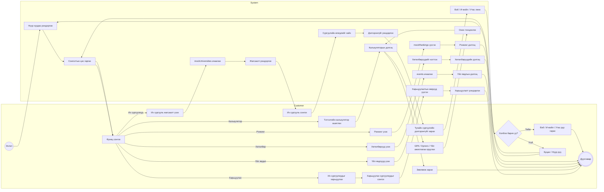

```mermaid
flowchart LR

subgraph Customer[Customer]
direction TB
C_Start((Эхлэл))
C_Select[Функц сонгох]
C_ViewUnis[Их сургууль жагсаалт үзэх]
C_PickUni[Их сургууль сонгох]
C_ViewDetails[Тухайн сургуулийн дэлгэрэнгүйг харах]
C_DecideContact{Холбоо барих уу?}
C_Contact[Вэб / И-мэйл / Утас руу гарах]
C_ViewRank[Рэнкинг үзэх]
C_ViewPrograms[Хөтөлбөрүүд үзэх]
C_ViewEvents[Үйл явдлууд үзэх]
C_UseCalc[Тэтгэлгийн калькулятор ашиглах]
C_InputData[GPA / Орлого / Үйл ажиллагаа оруулах]
C_SeeRecommendation[Зөвлөмж харах]
C_Compare[Их сургуулиудыг харьцуулах]
C_SelectForCompare[Харьцуулах сургуулиудыг сонгох]
C_BackHome[Буцах / Нүүр рүү]
C_End(((Дуусгавар)))
end

%% ---------- SYSTEM POOL ----------
subgraph System[System]
direction TB
S_RenderHome[Нүүр хуудас рэндэрлэх]
S_ShowNav[Сонголтын цэс гаргах]
S_FetchUnis[mockUniversities ачаалах]
S_RenderUniList[Жагсаалт рэндэрлэх]
S_GetUniById[Сургуулийн өгөгдлийг хайх]
S_RenderUniDetail[Дэлгэрэнгүйг рэндэрлэх]
S_AggregatePrograms[Хөтөлбөрүүдийг нэгтгэх]
S_RenderPrograms[Хөтөлбөрүүдийн дэлгэц]
S_BuildRankings[mockRankings үүсгэх]
S_RenderRankings[Рэнкинг дэлгэц]
S_FetchEvents[events ачаалах]
S_RenderEvents[Үйл явдлын дэлгэц]
S_CalcScore[Оноо тооцоолох]
S_RenderCalc[Калькуляторын дэлгэц]
S_BuildCompare[Харьцуулалтын мөрүүд үүсгэх]
S_RenderCompare[Харьцуулалт рэндэрлэх]
S_ShowContactLinks[Вэб / И-мэйл / Утас линк]
end

%% ---------- FLOW CONNECTIONS ----------

%% Эхлэх
C_Start --> S_RenderHome --> S_ShowNav --> C_Select

%% Их сургуулиудын урсгал
C_Select -->|Их сургуулиуд| C_ViewUnis --> S_FetchUnis --> S_RenderUniList --> C_PickUni --> S_GetUniById --> S_RenderUniDetail --> C_ViewDetails
C_ViewDetails --> S_ShowContactLinks --> C_DecideContact
C_DecideContact -->|Тийм| C_Contact --> C_End
C_DecideContact -->|Үгүй| C_BackHome --> S_ShowNav --> C_Select

%% Рэнкинг урсгал
C_Select -->|Рэнкинг| C_ViewRank --> S_BuildRankings --> S_RenderRankings --> C_End

%% Хөтөлбөрүүд урсгал
C_Select -->|Хөтөлбөр| C_ViewPrograms --> S_AggregatePrograms --> S_RenderPrograms --> C_End

%% Үйл явдлууд урсгал
C_Select -->|Үйл явдал| C_ViewEvents --> S_FetchEvents --> S_RenderEvents --> C_End

%% Тэтгэлгийн калькулятор урсгал
C_Select -->|Калькулятор| C_UseCalc --> S_RenderCalc --> C_InputData --> S_CalcScore --> S_RenderCalc --> C_SeeRecommendation --> C_End

%% Харьцуулалт урсгал
C_Select -->|Харьцуулах| C_Compare --> C_SelectForCompare --> S_BuildCompare --> S_RenderCompare --> C_End

%% Нүүр рүү буцах ерөнхий
C_BackHome --> S_RenderHome
```
