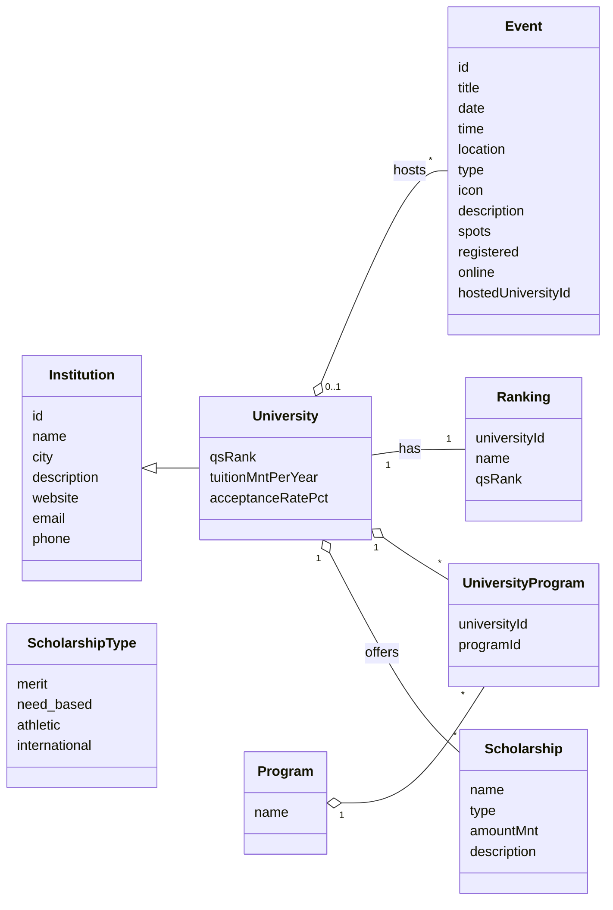

```mermaid
classDiagram
direction LR

class Institution {
  id
  name
  city
  description
  website
  email
  phone
}

class University {
  qsRank
  tuitionMntPerYear
  acceptanceRatePct
}
Institution <|-- University

class Scholarship {
  name
  type
  amountMnt
  description
}

class Program {
  name
}

class UniversityProgram {
  universityId
  programId
}

class Ranking {
  universityId
  name
  qsRank
}

class Event {
  id
  title
  date
  time
  location
  type
  icon
  description
  spots
  registered
  online
  hostedUniversityId
}

class ScholarshipType {
  merit
  need_based
  athletic
  international
}

University "1" o-- "*" Scholarship : offers
University "1" o-- "*" UniversityProgram
Program "1" o-- "*" UniversityProgram
University "1" -- "1" Ranking : has
University "0..1" o-- "*" Event : hosts
```
