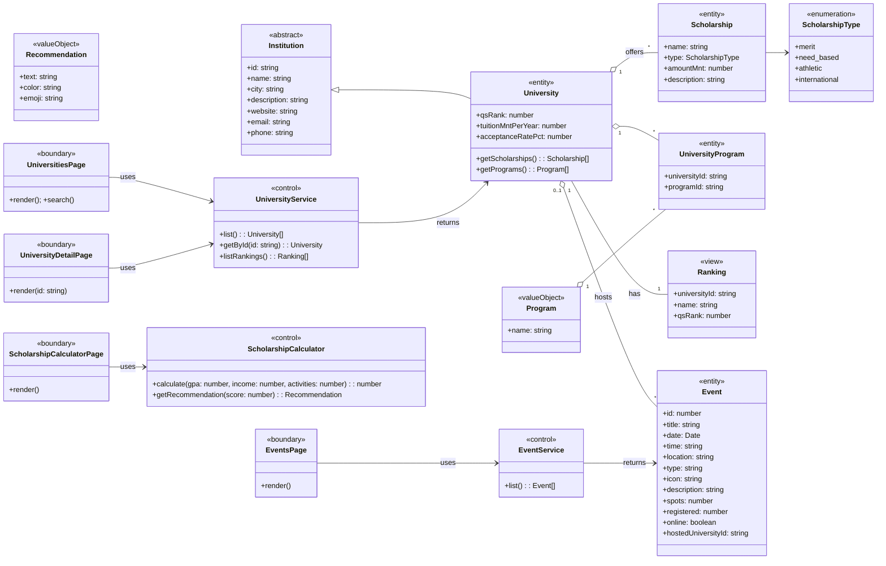

```mermaid
classDiagram
direction LR

class Institution <<abstract>> {
  +id: string
  +name: string
  +city: string
  +description: string
  +website: string
  +email: string
  +phone: string
}

class University <<entity>> {
  +qsRank: number
  +tuitionMntPerYear: number
  +acceptanceRatePct: number
  +getScholarships(): Scholarship[]
  +getPrograms(): Program[]
}

Institution <|-- University

class Scholarship <<entity>> {
  +name: string
  +type: ScholarshipType
  +amountMnt: number
  +description: string
}

class Program <<valueObject>> {
  +name: string
}

class UniversityProgram <<entity>> {
  +universityId: string
  +programId: string
}

class Ranking <<view>> {
  +universityId: string
  +name: string
  +qsRank: number
}

class Event <<entity>> {
  +id: number
  +title: string
  +date: Date
  +time: string
  +location: string
  +type: string
  +icon: string
  +description: string
  +spots: number
  +registered: number
  +online: boolean
  +hostedUniversityId: string
}

class ScholarshipType <<enumeration>> {
  +merit
  +need_based
  +athletic
  +international
}

Scholarship --> ScholarshipType
University "1" o-- "*" Scholarship : offers
University "1" o-- "*" UniversityProgram
Program "1" o-- "*" UniversityProgram
University "1" -- "1" Ranking : has
University "0..1" o-- "*" Event : hosts

class UniversityService <<control>> {
  +list(): University[]
  +getById(id: string): University
  +listRankings(): Ranking[]
}

class EventService <<control>> {
  +list(): Event[]
}

class ScholarshipCalculator <<control>> {
  +calculate(gpa: number, income: number, activities: number): number
  +getRecommendation(score: number): Recommendation
}

class Recommendation <<valueObject>> {
  +text: string
  +color: string
  +emoji: string
}

class UniversitiesPage <<boundary>> { +render(); +search() }
class UniversityDetailPage <<boundary>> { +render(id: string) }
class EventsPage <<boundary>> { +render() }
class ScholarshipCalculatorPage <<boundary>> { +render() }

UniversitiesPage --> UniversityService : uses
UniversityDetailPage --> UniversityService : uses
EventsPage --> EventService : uses
ScholarshipCalculatorPage --> ScholarshipCalculator : uses
UniversityService --> University : returns
EventService --> Event : returns
```
