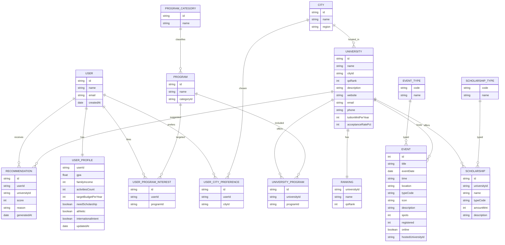

```mermaid
erDiagram
    USER {
      string id
      string name
      string email
      date createdAt
    }

    USER_PROFILE {
      string userId
      float gpa
      int familyIncome
      int activitiesCount
      int targetBudgetPerYear
      boolean needScholarship
      boolean athletic
      boolean internationalIntent
      date updatedAt
    }

    CITY {
      string id
      string name
      string region
    }

    PROGRAM_CATEGORY {
      string id
      string name
    }

    PROGRAM {
      string id
      string name
      string categoryId
    }

    UNIVERSITY {
      string id
      string name
      string cityId
      int qsRank
      string description
      string website
      string email
      string phone
      int tuitionMntPerYear
      int acceptanceRatePct
    }

    SCHOLARSHIP_TYPE {
      string code
      string name
    }

    SCHOLARSHIP {
      string id
      string universityId
      string name
      string typeCode
      int amountMnt
      string description
    }

    EVENT_TYPE {
      string code
      string name
    }

    EVENT {
      int id
      string title
      date eventDate
      string time
      string location
      string typeCode
      string icon
      string description
      int spots
      int registered
      boolean online
      string hostedUniversityId
    }

    UNIVERSITY_PROGRAM {
      string id
      string universityId
      string programId
    }

    USER_PROGRAM_INTEREST {
      string id
      string userId
      string programId
    }

    USER_CITY_PREFERENCE {
      string id
      string userId
      string cityId
    }

    RANKING {
      string universityId
      string name
      int qsRank
    }

    RECOMMENDATION {
      string id
      string userId
      string universityId
      int score
      string reason
      date generatedAt
    }

    %% Холбоонууд
    USER ||--|| USER_PROFILE : has
    USER ||--o{ USER_PROGRAM_INTEREST : likes
    PROGRAM ||--o{ USER_PROGRAM_INTEREST : targeted
    USER ||--o{ USER_CITY_PREFERENCE : prefers
    CITY ||--o{ USER_CITY_PREFERENCE : chosen
    CITY ||--o{ UNIVERSITY : located_in
    PROGRAM_CATEGORY ||--o{ PROGRAM : classifies
    UNIVERSITY ||--o{ UNIVERSITY_PROGRAM : offers
    PROGRAM ||--o{ UNIVERSITY_PROGRAM : included
    UNIVERSITY ||--o{ SCHOLARSHIP : offers
    SCHOLARSHIP_TYPE ||--o{ SCHOLARSHIP : typed
    UNIVERSITY ||--|| RANKING : has
    EVENT_TYPE ||--o{ EVENT : typed
    UNIVERSITY ||--o{ EVENT : hosts
    USER ||--o{ RECOMMENDATION : receives
    UNIVERSITY ||--o{ RECOMMENDATION : suggested
```
