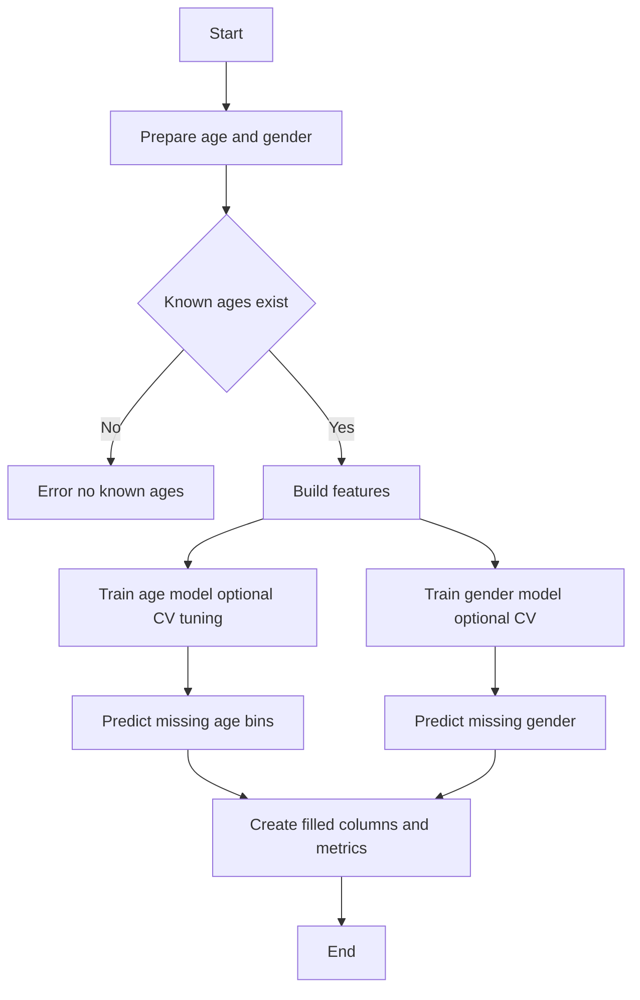

```mermaid
flowchart TD
  S[Start]
  S --> P1[Prepare age and gender]
  P1 --> D1{Known ages exist}
  D1 -->|No| E1[Error no known ages]
  D1 -->|Yes| F1[Build features]
  F1 --> A1[Train age model optional CV tuning]
  A1 --> A2[Predict missing age bins]
  F1 --> G1[Train gender model optional CV]
  G1 --> G2[Predict missing gender]
  A2 --> O1[Create filled columns and metrics]
  G2 --> O1
  O1 --> END[End]
```
