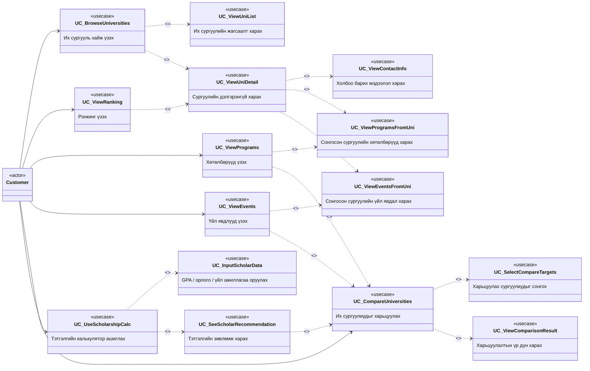

```mermaid
%% СИСТЕМИЙН USE CASE DIAGRAM
%% Customer бүх use case-д оролцоно, нийт систем,
%% мөн include / extend харилцааг багтаасан.

%% Mermaid‑ийн албан ёсны хэлбэр нь UML use case‑ийг бүрэн дэмждэггүй тул
%% classDiagram ашиглаад actor, use case, харилцааг тэмдэглэв.

classDiagram
direction LR

%% --- Actors ---
class Customer {
  <<actor>>
}

%% --- Use Cases (Нүүр түвшин) ---
class UC_BrowseUniversities {
  <<usecase>>
  Их сургууль хайж үзэх
}
class UC_ViewRanking {
  <<usecase>>
  Рэнкинг үзэх
}
class UC_ViewPrograms {
  <<usecase>>
  Хөтөлбөрүүд үзэх
}
class UC_ViewEvents {
  <<usecase>>
  Үйл явдлууд үзэх
}
class UC_UseScholarshipCalc {
  <<usecase>>
  Тэтгэлгийн калькулятор ашиглах
}
class UC_CompareUniversities {
  <<usecase>>
  Их сургуулиудыг харьцуулах
}

%% --- Дэд use case-ууд (include / extend-д ашиглагдах) ---

class UC_ViewUniList {
  <<usecase>>
  Их сургуулийн жагсаалт харах
}
class UC_ViewUniDetail {
  <<usecase>>
  Сургуулийн дэлгэрэнгүй харах
}
class UC_ViewContactInfo {
  <<usecase>>
  Холбоо барих мэдээлэл харах
}
class UC_ViewProgramsFromUni {
  <<usecase>>
  Сонгосон сургуулийн хөтөлбөрүүд харах
}
class UC_ViewEventsFromUni {
  <<usecase>>
  Сонгосон сургуулийн үйл явдал харах
}
class UC_InputScholarData {
  <<usecase>>
  GPA / орлого / үйл ажиллагаа оруулах
}
class UC_SeeScholarRecommendation {
  <<usecase>>
  Тэтгэлгийн зөвлөмж харах
}
class UC_SelectCompareTargets {
  <<usecase>>
  Харьцуулах сургуулиудыг сонгох
}
class UC_ViewComparisonResult {
  <<usecase>>
  Харьцуулалтын үр дүн харах
}

%% --- Actor холбоос ---
Customer --> UC_BrowseUniversities
Customer --> UC_ViewRanking
Customer --> UC_ViewPrograms
Customer --> UC_ViewEvents
Customer --> UC_UseScholarshipCalc
Customer --> UC_CompareUniversities

%% --- Include харилцаанууд ---

%% Их сургууль үзэх ерөнхий use case
UC_BrowseUniversities ..> UC_ViewUniList : <<include>>
UC_BrowseUniversities ..> UC_ViewUniDetail : <<include>>

%% Дэлгэрэнгүй харахад үргэлж холбоо барих мэдээлэл харах боломжтой
UC_ViewUniDetail ..> UC_ViewContactInfo : <<include>>

%% Хөтөлбөрүүд үзэх үед сургуулийн түвшний жагсаалтаас харах
UC_ViewPrograms ..> UC_ViewProgramsFromUni : <<include>>

%% Үйл явдлууд үзэх үед сургуулийн үйл явдлын жагсаалтыг харуулах
UC_ViewEvents ..> UC_ViewEventsFromUni : <<include>>

%% Тэтгэлгийн калькулятор
UC_UseScholarshipCalc ..> UC_InputScholarData : <<include>>
UC_UseScholarshipCalc ..> UC_SeeScholarRecommendation : <<include>>

%% Харьцуулалт хийхэд сургуулиудыг сонгох, харьцуулалтын харагдац заавал орно
UC_CompareUniversities ..> UC_SelectCompareTargets : <<include>>
UC_CompareUniversities ..> UC_ViewComparisonResult : <<include>>

%% --- Extend харилцаанууд ---

%% Их сургууль сонирхож байхад,
%% нэмж тухайн сургуулийн хөтөлбөр,
%% үйл явдал руу дэлгэрүүлэн орох боломжтой
UC_ViewUniDetail ..> UC_ViewProgramsFromUni : <<extend>>
UC_ViewUniDetail ..> UC_ViewEventsFromUni : <<extend>>

%% Рэнкинг үзэж байх үед тодорхой сургууль дээр дарж
%% дэлгэрэнгүй харах боломжтой
UC_ViewRanking ..> UC_ViewUniDetail : <<extend>>

%% Програм, үйл явдал үзэж байхдаа тухайн сургуулийг
%% бусадтай харьцуулахыг сонгож болно
UC_ViewPrograms ..> UC_CompareUniversities : <<extend>>
UC_ViewEvents ..> UC_CompareUniversities : <<extend>>

%% Тэтгэлгийн зөвлөмж гарсны дараа зөвлөмжид орсон
%% сургуулиудыг шууд харьцуулах боломж
UC_SeeScholarRecommendation ..> UC_CompareUniversities : <<extend>>
```
